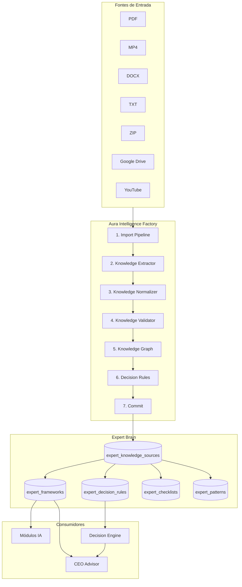

# Aura Intelligence Factory (AIF)

## Missão

A **Aura Intelligence Factory** é a infraestrutura definitiva de aprendizado do Aura. Não é um importador de cursos — é uma **fábrica de conhecimento** que transforma qualquer fonte em conhecimento estruturado e operacional antes de entrar no Expert Brain.

## Princípios

| Princípio | Descrição |
|-----------|-----------|
| **Persona-agnóstico** | Qualquer especialista entra pelo mesmo pipeline. Sem acoplamento a nomes ou gurus. |
| **Sem duplicação** | Validador remove duplicatas e detecta conflitos antes do commit. |
| **Somente estruturado** | Expert Brain recebe artefatos tipados — nunca `raw_text` persistido na fonte. |
| **Operacional** | Toda saída inclui regras de decisão utilizáveis, não apenas resumos. |
| **Desacoplado** | Não altera Product Factory, Sales System, Mission Core nem UI do dashboard. |

---

## Arquitetura



---

## Etapas do Pipeline

### 1. Import Pipeline

**Arquivo:** `lib/aif/import-pipeline.ts`

Responsável por receber arquivos e produzir texto normalizado para extração.

| Formato | Suporte | Mecanismo |
|---------|---------|-----------|
| PDF | ✅ | `pdf-parse` via `lib/expert-brain/parsers` |
| MP4 | ✅ | Whisper (`transcribeVideoBuffer`) |
| DOCX | ✅ | Extração OOXML via JSZip |
| TXT/MD | ✅ | UTF-8 direto |
| ZIP | ✅ | `parseZipCourse` (cursos estruturados) |
| Google Drive | ✅ | `rawText` pré-baixado pelo conector Drive |
| YouTube | ✅ | Transcrição fornecida (`youtubeTranscript` ou `rawText`) |

**Entrada:** `AifPipelineInput`  
**Saída:** `AifImportResult` com `rawText`, `wordCount`, `sourceType`

### 2. Knowledge Extractor

**Arquivo:** `lib/aif/knowledge-extractor.ts`

Extrai entidades de conhecimento do texto:

- Conceitos
- Frameworks
- Decision Rules
- Checklists
- KPIs
- Anti-patterns
- Cases
- Modelos mentais
- Princípios

Usa extração IA do Expert Brain (`extractFrameworks`, `extractDecisionRules`, etc.) + heurísticas para tipos adicionais.

### 3. Knowledge Normalizer

**Arquivo:** `lib/aif/knowledge-normalizer.ts`

Converte drafts em tipos padronizados AIF:

| Tipo AIF | Tipo TypeScript |
|----------|-----------------|
| Framework | `AifFramework` |
| Checklist | `AifChecklist` |
| DecisionRule | `AifDecisionRule` |
| KPI | `AifKpi` |
| Case | `AifCase` |
| Principle | `AifPrinciple` |
| MentalModel | `AifMentalModel` |
| AntiPattern | `AifAntiPattern` |
| Concept | `AifConcept` |

Todos os tipos estão definidos em `utils/aif.ts`.

### 4. Knowledge Validator

**Arquivo:** `lib/aif/knowledge-validator.ts`

Detecta e corrige:

- **Duplicações** — merge por `normalizeAifKey(name)`, mantém maior confidence
- **Conflitos** — regras contraditórias na mesma categoria
- **Contradições** — `whenNotToApply` vs `whenToApply` de outra regra
- **Baixa confiança** — entidades com score < 45%
- **Não-operacional** — regras sem `whenToApply` ou texto curto

**Saída:** `AifValidationReport` com `passed`, `issues`, `deduplicatedCount`, `averageConfidence`

### 5. Knowledge Graph

**Arquivo:** `lib/aif/knowledge-graph.ts`

Relaciona entidades em grafo direcionado:

```
Oferta → Landing → Copy → Criativos → Conversão
```

Cada entidade extraída é ligada ao nó de funil correspondente via `category`:

| Categoria | Nó de Funil |
|-----------|-------------|
| `offer_creation` | Oferta |
| `landing_page` | Landing |
| `copywriting` | Copy |
| `creative_strategy` | Criativos |
| `paid_traffic` | Conversão |

Relações: `influences`, `requires`, `validates`, `blocks`, `implements`, `measures`

### 6. Decision Rules

**Arquivo:** `lib/aif/decision-rules.ts`

Garante que o conhecimento seja **operacional**:

- Gera regras automáticas a partir de frameworks sem regra associada
- Gera regras a partir de itens de checklist quando há poucas regras
- Filtra regras não-operacionais antes do commit

**Regra operacional:** `rule.length >= 12` + `whenToApply` + `whenNotToApply` preenchidos.

### 7. Expert Brain (Commit)

**Arquivo:** `lib/supabase/services/aif.service.ts` → `commitStructuredKnowledgeToExpertBrain`

Recebe **apenas** `AifStructuredKnowledge` validado. Mapeamento para tabelas:

| Tipo AIF | Tabela Expert Brain | metadata.aif_type |
|----------|---------------------|-------------------|
| Framework | `expert_frameworks` | `framework` |
| MentalModel | `expert_frameworks` | `mental_model` |
| DecisionRule | `expert_decision_rules` | `decision_rule` |
| Checklist | `expert_checklists` | `checklist` |
| KPI | `expert_patterns` | `kpi` |
| Concept | `expert_patterns` | `concept` |
| AntiPattern | `expert_failure_patterns` | `anti_pattern` |
| Case | `expert_success_patterns` | `case` |
| Playbook | `expert_playbooks` | `aif_pipeline: true` |

**Importante:** `expert_knowledge_sources.raw_text` é `null` após commit AIF. O conteúdo bruto permanece apenas na fila de ingestão/aula, nunca no Expert Brain.

### 8. CEO Advisor

**Arquivo:** `lib/supabase/services/aif.service.ts` → `getAifCeoExpertKnowledgeBlock`

O CEO Advisor consulta o Expert Brain via `getExpertContext()` e recebe bloco estruturado via `buildAifExpertContextBlock`. **Nunca** consulta cursos ou `raw_text` diretamente.

Integrado em `createCeoPlan()` como campo `expert_brain_structured` no prompt da IA.

---

## Estrutura de Arquivos

```
lib/aif/
  import-pipeline.ts       # Etapa 1
  knowledge-extractor.ts   # Etapa 2
  knowledge-normalizer.ts  # Etapa 3
  knowledge-validator.ts   # Etapa 4
  knowledge-graph.ts       # Etapa 5
  decision-rules.ts        # Etapa 6
  index.ts                 # Barrel export

utils/aif.ts               # Tipos, helpers, blocos de prompt
utils/aif.test.ts          # Testes unitários

lib/supabase/services/aif.service.ts  # Orquestrador + commit + CEO bridge

app/api/aif/
  process/route.ts         # POST — processar texto via AIF
  health/route.ts          # GET — health check
```

---

## API

### `POST /api/aif/process`

Processa texto através do pipeline completo.

```json
{
  "title": "Módulo 3 — Ofertas",
  "raw_text": "...",
  "author": "Nome do Especialista",
  "niche": "infoprodutos",
  "source_type": "txt"
}
```

**Resposta:**

```json
{
  "ok": true,
  "stage": "commit",
  "expert_source_id": "uuid",
  "entity_count": 12,
  "validation": { "passed": true, "averageConfidence": 74 },
  "graph_edges": 18
}
```

### `GET /api/aif/health`

Retorna status, versão, estágios e fontes suportadas.

---

## Uso Programático

```typescript
import { runAifPipeline } from "@/lib/supabase/services/aif.service";

const result = await runAifPipeline({
  title: "Curso de Copy",
  sourceType: "pdf",
  buffer: fileBuffer,
  fileName: "modulo-1.pdf",
  author: "Especialista X",
  niche: "copywriting",
});

if (result.error) {
  console.error(result.stage, result.error);
} else {
  console.log("Source ID:", result.expertSourceId);
  console.log("Entidades:", result.knowledge);
}
```

---

## Integrações Existentes (roteadas via AIF)

| Sistema | Arquivo | Mudança |
|---------|---------|---------|
| Expert Brain Ingestion | `expert-brain-ingestion.service.ts` | `runAifPipeline` substitui `ingestKnowledgeSource` |
| Knowledge Sources | `knowledge-sources-pipeline.service.ts` | `runAifPipeline` |
| Expert Brain Dashboard Service | `expert-brain-dashboard.service.ts` | `runAifPipeline` |
| Expert Brain Ingest API | `app/api/expert-brain/ingest/route.ts` | `runAifPipeline` |
| CEO Advisor | `ceo.service.ts` | `getAifCeoExpertKnowledgeBlock` |

**Não alterados:** Product Factory, Sales System, Mission Core, componentes de UI do dashboard.

---

## Adicionar Novo Especialista

1. Importar conteúdo via qualquer fonte suportada (PDF, vídeo, Drive, etc.)
2. Informar `author` e `niche` como metadados — sem hardcode no código
3. O pipeline AIF extrai, normaliza, valida e grava automaticamente
4. Módulos IA consomem via `getExpertContext()` / `buildTransversalGenerationContext()`
5. CEO consome via `getAifCeoExpertKnowledgeBlock()`

---

## Confidence Score

Cada entidade AIF carrega `AifConfidenceScore`:

```typescript
{
  value: number;    // 0-100
  reasons: string[]; // ex: ["extraído por IA", "validação AIF"]
}
```

O validador pode deduplicar mantendo a entidade de maior confidence e aplicar boost pós-validação.

---

## Testes

```bash
npm run test        # inclui utils/aif.test.ts
npm run typecheck
npm run build
```

Cobertura de testes AIF:

- Normalização de chaves
- Inferência de categoria por nicho
- Normalizer (trim, defaults)
- Validator (deduplicação)
- Knowledge Graph (cadeia de funil)
- Decision Rules (geração operacional)
- CEO block (sem conteúdo bruto)

---

## Roadmap

- [ ] Fila dedicada `aif_processing_queue` com retry e observabilidade
- [ ] Persistência do grafo em tabela `aif_knowledge_edges`
- [ ] YouTube auto-transcript via API externa
- [ ] Merge cross-source (mesmo conceito de fontes diferentes)
- [ ] UI dedicada AIF (fora do dashboard atual)

---

## Versão

**AIF v1.0.0** — Pipeline completo: import → extract → normalize → validate → graph → decision rules → commit.
