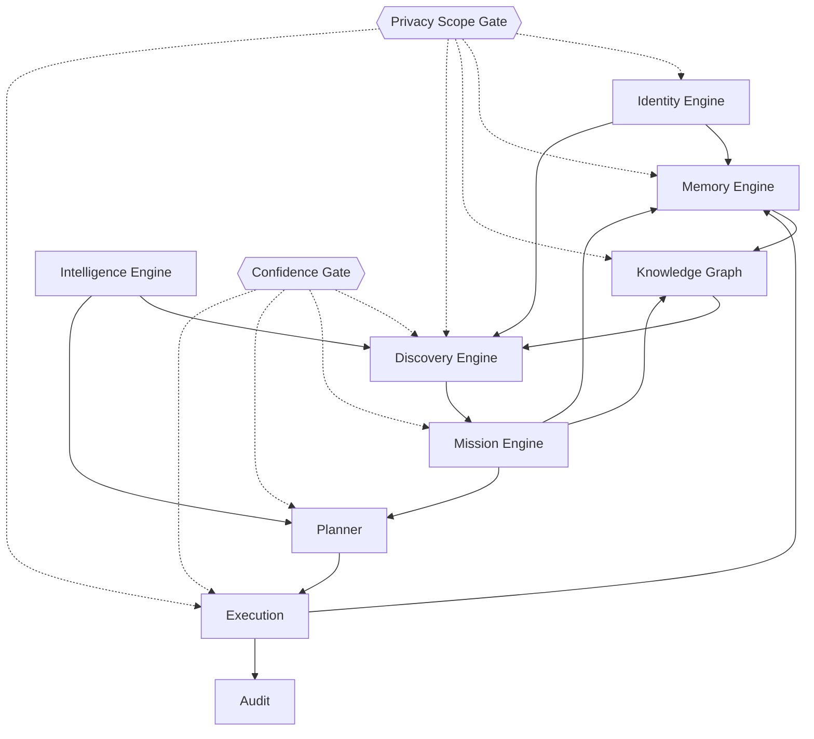

# RFC-001 — Pipeline fundacional do Aura Brain

| Campo | Valor |
|-------|-------|
| Status | Accepted (design) |
| Sprint | 6.1 — Foundation ADRs |
| Data | 2026-07-28 |
| ADRs | 001–007 |
| Escopo | Documentação somente — sem implementação, migrations ou tabelas |

---

## 1. Resumo

Este RFC descreve como os motores fundacionais e os sistemas já existentes colaboram em um único pipeline:

```
Identity
    ↓
Memory
    ↓
Knowledge Graph
    ↓
Discovery
    ↓
Mission Engine
    ↓
Planner
    ↓
Execution
```

Gates transversais: **Confidence** (ADR-005) e **Privacy & Ownership** (ADR-007).  
Filosofia norteadora: **ADR-001**.

---

## 2. Motivação

Sprints 2–5 entregaram percepção (Intelligence), orquestração (Aura Brain Core), e organização por missões (Mission Engine).  
Ainda falta a fundação que responde:

- Quem é o usuário? → Identity  
- O que o sistema lembra? → Memory  
- Como os fatos se relacionam? → Knowledge Graph  
- O que merece atenção nova? → Discovery  

Sem isso, Mission/Planner continuam poderosos mas “míopes”.

---

## 3. Pipeline detalhado

### 3.1 Identity

**Entra:** perfil auth, settings de autonomia, declarações do usuário, promoções aprovadas da Memory.  
**Sai:** Identity document por escopo (personal / workspace member).  
**Consumidores:** todos os estágios abaixo.

Identity define *tom*, *constraints*, *afinidade de missão* e *limites de automação*.

### 3.2 Memory

**Entra:** eventos do sistema (tarefas concluídas, feedback, insights confirmados), working context do Meu Dia.  
**Sai:** entries tipadas (episódica, semântica, procedural, feedback, working).  
**Efeito:** recall para Graph/Discovery/Planner; candidatos a promoção.

Memory não decide ações; apenas registra e recupera evidências.

### 3.3 Knowledge Graph

**Entra:** missões e dependências, metas, recursos, memórias semânticas promovidas, referências a módulos.  
**Sai:** subgrafo consultável da vida/negócios do usuário.  
**Efeito:** respostas estruturais (“o que bloqueia X?”).

O grafo é o mapa; Identity é a bússola; Memory é o diário.

### 3.4 Discovery

**Entra:** Identity + Memory + Graph + Intelligence (estado atual) + missões ativas.  
**Sai:** candidatos tipados (missão, oportunidade, experimento, risco, aprendizado, link).  
**Efeito:** propostas com evidências e Confidence — sem Execution.

Discovery responde “o que ainda não é missão, mas deveria ser considerado?”.

### 3.5 Mission Engine

**Entra:** missão criada pelo usuário **ou** `MissionCandidate` aceito.  
**Sai:** missão planejada (fases, marcos, tarefas, riscos, deps, progresso, score).  
**Efeito:** eixo de organização da vida (ADR-001).

Missões materializam direção; módulos apenas servem.

### 3.6 Planner

**Entra:** Intelligence priorities + Mission recommendations + Discovery drafts aceitos + settings/autonomia.  
**Sai:** planos e `ProposedAction` / `ExecutableAction` com permissões.  
**Efeito:** ordena o que pode ser preparado ou executado.

Planner **nunca** executa; só seleciona e ordena (já verdade no Brain Core).

### 3.7 Execution

**Entra:** ações permitidas por Autonomy + Risk + Confidence + Privacy.  
**Sai:** efeitos no mundo (notificação, rascunho, mutação confirmada) + Audit.  
**Efeito:** mudança real, sempre rastreável.

Defaults:

- LOW + AUTO_SAFE + Confidence HIGH no disparador → pode automatizar  
- Financeiro / externo / delete / HIGH|CRITICAL → CONFIRM  
- Criar empresa / pagamentos → nunca automático  

---

## 4. Diagrama de fluxo ( Mermaid )



**Feedback loops**

- Execution → Memory (episódica) → possível promoção → Identity/Graph  
- Mission progress → Graph edges / Memory  
- User feedback → Memory Feedback → Discovery dedupe  

---

## 5. Papel da Intelligence Engine

Intelligence permanece a **percepção do estado atual** (prioridades, alertas, score).  
Não é substituída por Discovery.

| Camada | Tempo | Pergunta |
|--------|-------|----------|
| Intelligence | Agora | O que está errado/urgente hoje? |
| Discovery | Frente | O que deveria virar direção/missão? |
| Mission | Horizonte | Como organizar essa direção? |
| Planner/Execution | Ação | O que fazer e o que pode rodar? |

---

## 6. Contratos entre estágios (conceituais)

| De → Para | Contrato |
|-----------|----------|
| Identity → * | Preferências, constraints, afinidades, escopo |
| Memory → Graph | Fatos semânticos com Confidence ≥ limiar |
| Memory → Discovery | Evidências + anti-spam feedback |
| Graph → Discovery | Lacunas, bloqueios, links fracos |
| Discovery → Mission | `MissionCandidate` aceito pelo usuário (ou semi-auto futuro só SUGGEST) |
| Mission → Planner | Recommendations + safe automation proposals |
| Planner → Execution | ExecutableAction com canExecute |
| Execution → Memory/Audit | Resultado e trilha |

Facades de produto futuras devem preservar o padrão já usado: **um entrypoint por motor** (`getIdentity`, `getMemory`, `queryGraph`, `getDiscovery`, `getMissionEngine`, `runAuraBrain`).

---

## 7. Cenário ponta a ponta

**Usuário:** quer ir à Disney em 12 meses; tem hábitos irregulares de economia; autonomia SUGGEST.

1. **Identity:** papel pessoal, preferência SUGGEST, constraint “não tocar reserva de emergência”.  
2. **Memory:** episódios de gastos altos em delivery; feedback ignorando “cortar streaming”.  
3. **Graph:** ainda sem missão TRAVEL; há Goal financeiro genérico fraco.  
4. **Intelligence:** alerta de orçamento MEDIUM/HIGH no mês.  
5. **Discovery:** `MissionCandidate` TRAVEL “Disney” (evidência: intenção declarada + prazo + gap de missão), Confidence MEDIUM.  
6. **Usuário aceita** → **Mission Engine** gera fases Economia → Reservas → Execução, com deps passagem←economizar←meta.  
7. **Planner:** propõe lembrete LOW e rascunho de meta; não cria lançamento sozinho.  
8. **Execution:** notificação interna se AUTO_SAFE; qualquer movimento financeiro → CONFIRM.  
9. **Audit + Memory:** registram propostas e conclusões de tarefas.

---

## 8. Não-objetivos deste RFC

- Não define schemas SQL, migrations ou tabelas.  
- Não escolhe vendor de grafo ou vector DB.  
- Não autoriza implementação nesta sprint.  
- Não renomeia Expert Brain.  
- Não introduz autonomia irrestrita.

---

## 9. Ordem sugerida de implementação (sprints futuras)

> Apenas orientação; cada sprint deve citar ADRs/RFC explicitamente.

1. Identity bootstrap a partir de profile + settings  
2. Memory tipada (adapters sobre stores atuais)  
3. Graph projeção a partir de Mission Engine  
4. Confidence gates no Planner/Execution  
5. Discovery candidates → UI de aceite → Mission  
6. Privacy: export/delete pack  

---

## 10. Riscos do pipeline completo

| Risco | Mitigação |
|-------|-----------|
| Pipeline rígido demais | Estágios degradáveis (Mission funciona sem Discovery) |
| Acoplamento circular | Promotion só Memory→Identity/Graph com gate |
| Latência no Meu Dia | Cache por estágio; reuse Intelligence (padrão atual) |
| Violação de privacy em joins | Escopo em todo artefato |
| Over-automation | ADR-005 + ADR-001 princípios 3–4 |

---

## 11. Critérios de aceite do design (Sprint 6.1)

- [x] ADRs 001–007 publicados com seções pedidas  
- [x] RFC descreve o pipeline Identity→…→Execution  
- [x] Gates Confidence e Privacy explícitos  
- [x] Sem código, sem migrations, sem tabelas  
- [x] Compatibilidade com Mission Engine, Intelligence e Brain Core preservada conceitualmente  

---

## 12. Referências

- [ADR-001 Filosofia](./ADR-001-filosofia-aura-brain.md)  
- [ADR-002 Identity](./ADR-002-identity-engine.md)  
- [ADR-003 Memory](./ADR-003-memory-engine.md)  
- [ADR-004 Knowledge Graph](./ADR-004-knowledge-graph.md)  
- [ADR-005 Confidence](./ADR-005-confidence-engine.md)  
- [ADR-006 Discovery](./ADR-006-discovery-engine.md)  
- [ADR-007 Privacy & Ownership](./ADR-007-privacy-ownership.md)  
- Relatórios: `reports/sprint-4-aura-brain-core.md`, `reports/sprint-5-mission-engine.md`, `reports/aura-brain-security-model.md`
