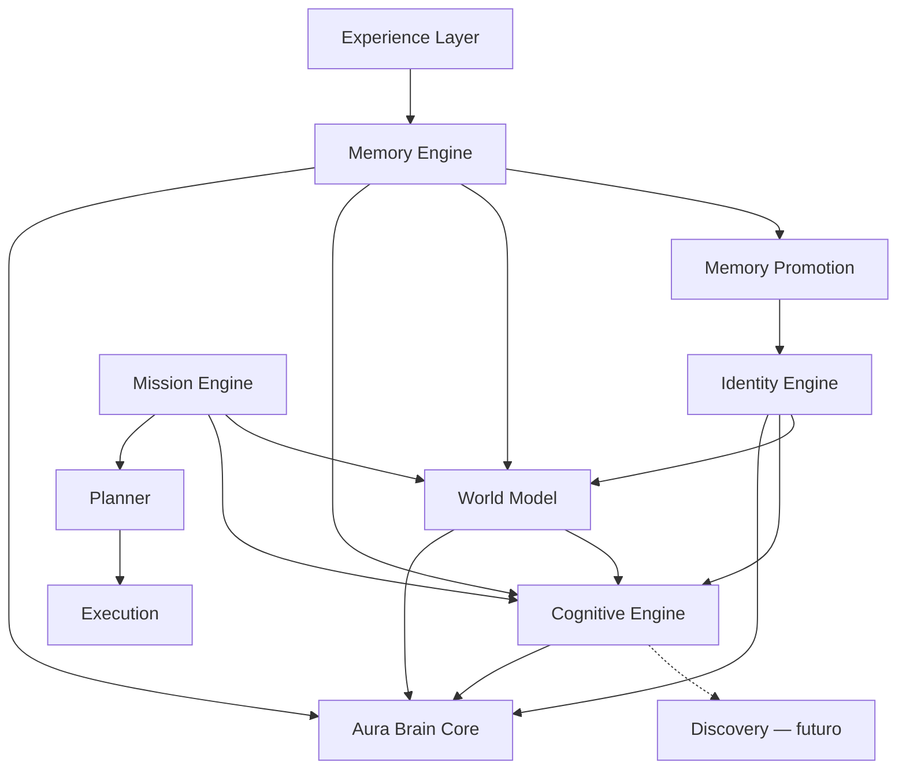

# Aura Brain Architecture v1.0

| Campo | Valor |
|-------|-------|
| Status | Baseline RC1 |
| Data | 2026-07-28 |
| Escopo | Kernel Cognitivo (Sprints 6.1–6.5) |
| Discovery | ADR-006 aceito — **não implementado** |
| Decision Support | Fora do escopo (Sprint 7.0+) |

---

## 1. Visão geral

O **Aura Brain** é o sistema operacional cognitivo do usuário para vida e negócios (ADR-001).  
A Architecture v1.0 congela o **Kernel Cognitivo** implementado até a Sprint 6.5:

Experience → Memory → Promotion → World Model → Cognitive Engine → *(Discovery futuro)* → Mission / Planner → Execution

Identity atua como fonte de claims confirmadas e hints read-only ao Brain.  
Missões e módulos de domínio permanecem **autoridade operacional**.

## 2. Filosofia

Estrutura > chat · Missão > módulo · Confiança antes de ação · Ownership do usuário · Nunca inventar fatos · Auditabilidade · Sugestão padrão.

## 3. Objetivos

- Plataforma cognitiva estável, documentada e testada.
- Contratos públicos classificados.
- Fronteira de execução explícita: `executionInfluence: "none"` no kernel.

## 4. Não objetivos (v1.0)

Decision Support · Scenario/Priority engines · Discovery completo · agentes · Neo4j · vector DB obrigatória · execução a partir de artefatos cognitivos · automações novas.

## 5. Pipeline oficial (implementação real)

```
Experience Layer
        ↓
Memory Engine (+ Promotion Engine)
        ↓
World Model
        ↓
Cognitive Engine
        ↓
[Discovery Engine — ADR-006, não implementado]
        ↓
Mission Engine / Planner / Aura Brain Core
        ↓
Execution (gated; kernel não dispara)
```

Identity fornece contexto paralelo (claims + hints).  
Intelligence Engine permanece percepção do *agora*.

## 6. Diagrama das camadas



## 7–17. Responsabilidades

| Camada | Responsabilidade | Execução |
|--------|------------------|----------|
| Experience | Normaliza eventos | nenhuma |
| Identity | Claims tipadas, revisão humana | `none` (hints) |
| Memory | Recordação tipada | `none` |
| Promotion | Propõe Identity; não sobrescreve correções | n/a |
| World Model | Projeção cognitiva entidades/relações | `none` |
| Cognitive | Artefatos explicáveis | `none` |
| Discovery | Sinais de atenção (futuro) | — |
| Mission | Autoridade de missões | operacional |
| Planner | Ordena propostas | não executa sozinho |
| Brain Core | Orquestra + slices read-only | gated |

## 18. Fontes operacionais

Tabelas/módulos de domínio (missões, finanças, calendário, etc.) são autoridade operacional. World Model **projeta**; não substitui.

## 19. Matriz de autoridade (resumo)

| Fonte | Operacional | Factual | Pode inferir | Sobrescreve fontes? |
|-------|-------------|---------|--------------|---------------------|
| User correction | alta | alta | não | sim (preferências/interpretação) |
| Identity CONFIRMED | — | alta | limitada | não em domínio |
| Memory | — | histórica | limitada | não |
| World Model | — | projeção | baixa | não |
| Cognitive | — | interpretação | sim (validada) | não |
| Discovery (futuro) | — | sinal | sim | não |
| LLM/provider | nenhuma | nenhuma | redação | não |
| Domínio/Mission | alta | operacional | — | n/a |

Detalhes: [matrices.md](./matrices.md).

## 20. Dependências permitidas

| Origem | Destino | Tipo |
|--------|---------|------|
| Memory service | Identity service | promoção (contratos públicos) |
| World projectors | Identity/Memory/Mission types | read + write world |
| Cognitive service | Identity/Memory/World/Mission | read-only |
| Brain Core | *ForBrain facades | read-only |
| UI | services/actions | obrigatório |

**Proibido:** Cognitive → Execution; Identity ↔ Discovery; UI → stores internos.

## 21. Contratos públicos

Ver [internal-api-v1.md](./internal-api-v1.md).

Namespaces conceituais: `identity.*` · `memory.*` · `worldModel.*` · `cognitive.*` · `discovery.*` (futuro).

## 22. Referências

Shape canônico RC1: `lib/aura-kernel` `SourceReference` `{ entityType, entityId, extra? }`.  
Engines mantêm aliases locais equivalentes (consolidação gradual).

## 23–24. Confidence e evidências

Scores **não atravessam** camadas sem transformação.  
Cognitive: evidence/pattern/hypothesis/insight/recommendation separados + `confidenceMethodVersion`.  
Duplicatas não aumentam confiança. Inferência ≤ 95.

## 25–28. Lifecycle, feedback, suppression, temporalidade

Famílias: Observation · Review · Knowledge · Artifact · Operational · Deletion.  
REJECTED/DELETED/OUTDATED/SUPERSEDED/ARCHIVED com regras por engine.  
Suppression é **por camada** (não bloqueia Memory ao rejeitar Insight).

## 29–32. Idempotência, dedupe, reconciliação, auditoria

Fingerprints / sourceReference / idempotencyKey por engine.  
Audit append-only nas tabelas `aura_*_audit`.

## 33–35. RLS, privacidade, sensíveis

RLS `auth.uid() = user_id`. ADR-007. Bloqueio de inferência clínica/psicológica.

## 36–38. Providers, prompt injection, explainability

Provider opcional (`none`). Sem tool use. Sem CoT persistida. Explicações = evidências + premissas + método + limitações.

## 39–40. Limite de execução / executionInfluence

Kernel Cognitivo **sempre** `"none"`. Capacidades proibidas: criar missão, agenda, finanças, mensagens, automações a partir de Identity/Memory/World/Cognitive.

## 41–43. Cache, performance, testes

Cache ~5s por user/workspace; invalidação em mutação.  
Suites: `test:identity` · `test:memory` · `test:world` · `test:cognitive` · `test:rc1` · `test:security`.

## 44–46. Versionamento, compatibilidade, extensibilidade

Ver internal-api-v1 e [new-engine-checklist.md](./new-engine-checklist.md).

## 47. Processo ADR/RFC

ADRs decidem. RFCs implementam. Código cita ADRs. Mudança de princípio = novo ADR.

## 48. Checklist novas engines

[new-engine-checklist.md](./new-engine-checklist.md)

## 49. Limitações conhecidas

- Discovery não implementado (pipeline documenta estágio futuro).
- ADR-005 Confidence Engine unificado ainda parcial (por engine).
- Persistência dual best-effort (store + upsert).
- `types/database.ts` sem tabelas 6.2–6.5 regeneradas.
- SourceReference duplicado em 4 packages (canônico em `aura-kernel`).
- Provider LLM real não ligado.

## 50. Roadmap de alto nível

1. **RC1** — consolidação (este documento).  
2. **Sprint 6.6 / Discovery V1** — consumir Cognitive, sem Decision Support.  
3. **Sprint 7.0** — Decision Support Foundation.  
4. Não iniciar 7.0 nesta RC1.

## Divergências ADR ↔ implementação

| Item | ADR | Código | Tratamento RC1 |
|------|-----|--------|----------------|
| Discovery no pipeline | ADR-006 / README | Ausente | Documentado; pendência explícita |
| Confidence Engine unificado | ADR-005 | Parcial por engine | Documentado |
| RFC-001 ordem antiga Identity→… | Histórico | Pipeline atualizado 6.3–6.5 | README ADR atual |
| Identity hints sem executionInfluence | implícito | Corrigido na RC1 | Corrigido |
| UI → store direto | anti-padrão | World/Insights | Corrigido |
| ADR-009 | — | Não existe | Ausência registrada |
| Sprint 6.6 report | — | Não existe | Ausência registrada |
